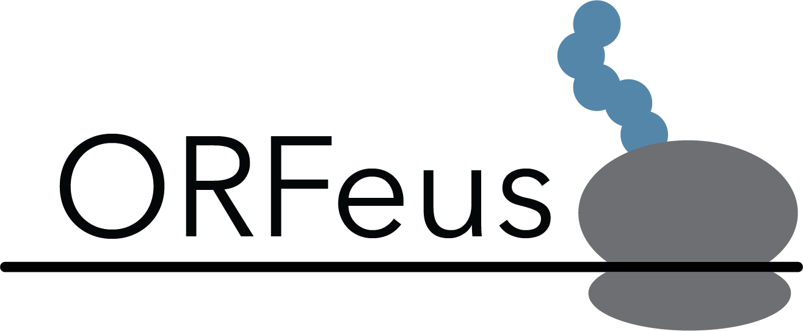
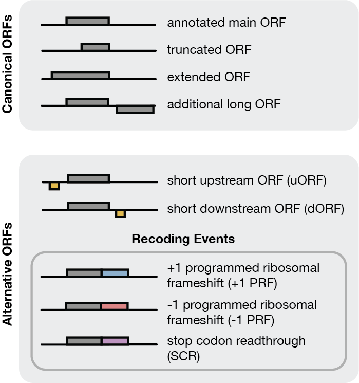
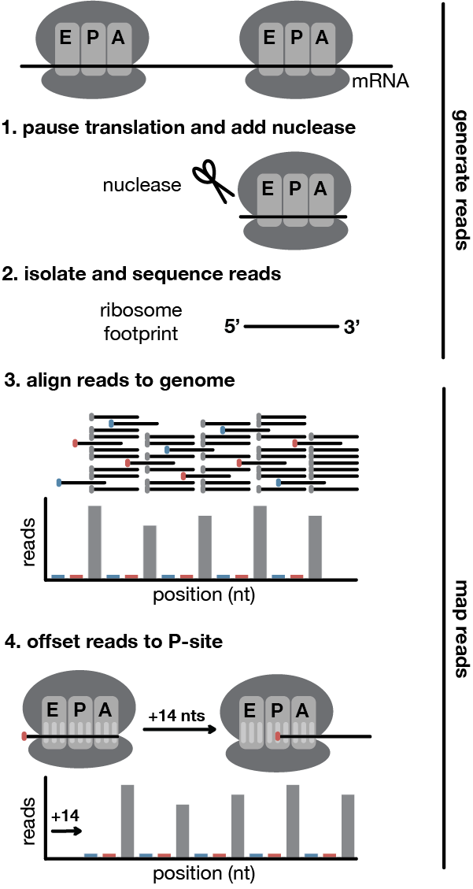
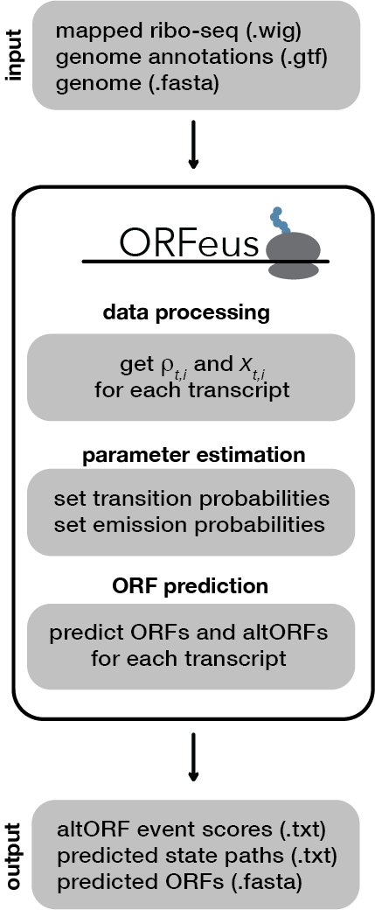

ORFeus is an ORF prediction tool designed to detect alternative translation
events, including programmed ribosomal frameshifts, stop codon readthrough, and
short upstream or downstream ORFs. It requires aligned ribosome profiling
(ribo-seq) reads, reference transcript annotations, and a reference genome.
ORFeus can be run on both bacterial and eukaryotic data.

Note that high-resolution (even nucleotide-resolution) ribosome profiling data
is ideal. The higher-resolution the data and the deeper the sequencing, the
better predictions ORFeus will make.

# Quick Start

Build the model:

    python build.py forward.wig reverse.wig genome.fa annotations.gtf

Run the model:

    python run.py data.txt.gz parameters_h1.npy parameters_h0.npy

# Overview

ORFeus requires the following input files. (See [input files](#input-files) for
details on preparing these to work with ORFeus, particularly the aligned
ribo-seq reads file.)

1. Aligned ribo-seq read counts (format: wiggle or bedgraph)
2. Transcript annotations (format: gtf or gff)
3. Genome (format: fasta)

### Reasons to use ORFeus:
  - You are interested in finding alternative translation events in an
annotated species. (Run ORFeus and look at the top predictions.)
  - You want to find changes in translation across multiple conditions or
timepoints. (Run ORFeus separately on ribo-seq data from each condition and
compare predictions.)

### Reasons not to use ORFeus:
  - You need a _de novo_ ORF caller for a novel genome. (ORFeus requires input
transcript annotations.)
  - You don't have high-resolution ribo-seq data. (ORFeus infers translation
based on ribosome profiling reads.)

ORFeus can predict the following types of canonical and alternative ORFs:

# Dependencies

[Numpy](https://numpy.org/) \
[Pandas](https://pandas.pydata.org/) \
[Scipy](https://scipy.org/) \
[Matplotlib](https://matplotlib.org/)

We recommend installing [Anaconda](https://www.anaconda.com/), which is a
Python distribution that comes with all of these packages.

# Installation

## Install from source

    git clone https://github.com/morichardson/ORFeus

## Run example

    cd ORFeus

    python orfeus/build.py data/coronavirus/Finkel2021_forward.wig data/Finkel2021_reverse.wig data/coronavirus/dna.fa data/coronavirus/annotations.gtf -o data/coronavirus/

    python orfeus/run.py data/coronavirus/data.txt.gz data/coronavirus/parameters_h1.npy data/coronavirus/parameters_h0.npy -o data/coronavirus/

# Input files

## Transcript annotations

The annotations file must be in [GTF or GFF
format](http://genome.ucsc.edu/FAQ/FAQformat#format3).
At minimum, the annotations file must contain the following columns
(placeholder columns are not used by ORFeus and can be populated with any value,
though the standard is `.`):
  - `seqname`: name of the chromosome (note this must match exactly the `seqname` in the genome sequence file)
  - `source`: placeholder
  - `feature`: feature type (note only `five_prime_utr`, `exon`, and `three_prime_utr` features will be kept)
  - `start`: first position of the feature, 1-indexed
  - `end`: last position of the feature, 1-indexed
  - `score`: placeholder
  - `strand`: + (forward) or - (reverse)
  - `frame`: placeholder
  - `attribute`: semicolon-separated list with additional information (note only the info below will be kept)
      - `transcript_id`
      - `transcript_name`
      - `transcript_biotype` (note only `"protein_coding"` features will be kept)

Please note that any chromosomes (`seqname`) column included in the annotations
file will be considered in by ORFeus when setting parameters. **Be sure to remove
any extra chromosomes or scaffolds you don't want considered in the final
analysis (e.g. mitochondrial chromosomes should be removed if your ribo-seq
data is for cytosolic RNA)** This is very important to make sure the parameters
are set correctly. Otherwise added noise from these extra chromosomes is
incorporated into the model.

Below is an example transcript from a GTF file that meets the minimum
requirements. All placeholder fields have been populated with a period.

    V	.	five_prime_utr	546794	546816	.	+	.	transcript_id "YER178W_mRNA"; transcript_name "PDA1"; transcript_biotype "protein_coding";
    V	.	exon	        546817	548079	.	+	.	transcript_id "YER178W_mRNA"; transcript_name "PDA1"; transcript_biotype "protein_coding";
    V	.	three_prime_utr	548080	548208	.	+	.	transcript_id "YER178W_mRNA"; transcript_name "PDA1"; transcript_biotype "protein_coding";

## Genome sequence

The genome sequence file must be in
[FASTA format](https://blast.ncbi.nlm.nih.gov/doc/blast-topics/). There should
be one sequence entry for each unique `seqname` (chromosome) in the annotations
file.

Below is an example FASTA file excerpt for the chromosome of the above
example transcript. Note that the `seqname` matches the `seqname` column entries
in the annotations example.

    >V dna:chromosome chromosome:R64-1-1:V:1:576874:1 REF
    CGTCTCCTCCAAGCCCTGTTGTCTCTTACCCGGATGTTCAACCAAAAGCTACTTACTACC
    TTTATTTTATGTTTACTTTTTATAGATTGTCTTTTTATCCTACTCTTTCCCACTTGTCTC
    TCGCTACTGCCGTGCAACAAACACTAAATCAAAACAGTGAAATACTACTACATCAAAACG
    CATATTCCCTAGAAAAAAAAATTTCTTACAATATACTATACTACACAATACATAATCACT
    ...

## Aligned ribo-seq read counts

The final aligned ribo-seq read counts must be in either
[WIG format](http://genome.ucsc.edu/goldenPath/help/wiggle.html)
or [BedGraph format](http://genome.ucsc.edu/goldenPath/help/bedgraph.html).
The raw reads must be aligned and then the read ends should be offset to
correspond to the P-site of the ribosome. The count of read ends at each
position of the genome should be stored, with one file for the forward strand
and one for the reverse strand.

### Align raw reads to genome

Align raw ribo-seq reads to the genome. Filter out reads mapping to annotated
ncRNA sequences. You should decide whether uniqely-mapping or multi-mapping
is appropriate for your data set.

Uniquely-mapping reads:  
- filters out reads that map to repetitive regions (e.g. regions with repeated
  sequences may appear as gaps in the read density,
  even though they may actually be translated)
- filters out reads that map to similar or related sequences (e.g. insertion
  sequences that have multiple copies in the genome will have no reads,
  even though they may actually be translated)

Multi-mapping reads:
- generates confounding signals from mis-mapped multi-mapping reads
  (e.g. reads that were actually generated from one transcript also map to
    another transcript, adding noise)
- complicates interpretation of predictions (e.g. predictions of alternative
  events may be due to reads from that transcript or another transcript)

In some cases, you may want to run ORFeus twice:
once on the uniquely-mapped reads and once on the multi-mapped reads. This
will allow you to compare the predictions and determine which events
may be artifacts of read mapping. Any predictions that differ between the two
runs should be examined more closely, since they might arise from mapping
artifacts.

### Offset aligned reads to P-site

Before passing the data to ORFeus, you need to offset the read ends so they
align to a position within the P-site of the ribosome. This lets ORFeus infer
the exact codon being translated for each read.

You can determine the offset for each read length and export the resulting read
counts using existing software packages like
[Shoelaces](https://bitbucket.org/valenlab/shoelaces/src/master/) or using your
own custom scripts.

# Usage

### Build the model

    python orfeus/build.py forward.wig reverse.wig genome.fa annotations.gtf

Building the model involves processing the data and setting the model parameters
(transition probabilities, emission probabilities).
Run `python orfeus/build.py -h` to see all available options.

    usage: build.py [-h] [-s SKIP [SKIP ...]] [--data_file DATA_FILE] [-o OUTDIR]
                  [-a ALPHA] [-b BETA] [-g GAMMA] [-d DELTA] [-z ZETA] [--f5 F5]
                  [--f3 F3] [--utr5 UTR5] [--utr3 UTR3] [--orf ORF]
                  [--uorf UORF] [--dorf DORF]
                  [--start_codons [START_CODONS [START_CODONS ...]]]
                  [--sense_codons [SENSE_CODONS [SENSE_CODONS ...]]]
                  [--stop_codons [STOP_CODONS [STOP_CODONS ...]]] [-r BINS] [-l]
                  [-m MIN] [-M MAX] [-p] [-f] [-c] [--iters ITERS]
                  [--window WINDOW] [--threads THREADS]
                  plus_file minus_file seqs_file annotations_file

    Build ORFeus model

    positional arguments:
    plus_file             riboseq plus strand bg/wig file path
    minus_file            riboseq minus strand bg/wig file path
    seqs_file             genome or transcriptome fasta file path
    annotations_file      annotations gtf/gff file path

    optional arguments:
    -h, --help            show this help message and exit
    -s SKIP [SKIP ...], --skip SKIP [SKIP ...]
                          list known frameshifted genes that should be filtered
                          out before codon assignments
    --data_file DATA_FILE
                          processed data file path
    -o OUTDIR, --outdir OUTDIR
                          output directory for all intermediate and results
                          files
    -a ALPHA, --alpha ALPHA
                          probability of PRF
    -b BETA, --beta BETA  probability of -1 PRF given PRF
    -g GAMMA, --gamma GAMMA
                          probability of stop codon readthrough
    -d DELTA, --delta DELTA
                          probability of upstream or downstream short ORFs
    -z ZETA, --zeta ZETA  probability of multiple non-overlapping ORFs
    --f5 F5               fraction of transcripts with 5'UTRs (default:
                          calculated from annotations)
    --f3 F3               fraction of transcripts with 3'UTRs (default:
                          calculated from annotations)
    --utr5 UTR5           mean nucleotide length of 5'UTRs (default: calculated
                          from annotations)
    --utr3 UTR3           mean nucleotide length of 3'UTRs (default: calculated
                          from annotations)
    --orf ORF             mean nucleotide length of main ORFs (default:
                          calculated from annotations)
    --uorf UORF           mean nucleotide length of upstream short ORFs
                          (suggested: 50)
    --dorf DORF           mean nucleotide length of downstream short ORFs
                          (suggested: 50)
    --start_codons [START_CODONS [START_CODONS ...]]
                          list of valid start codons (default: infer from the
                          annotations)
    --sense_codons [SENSE_CODONS [SENSE_CODONS ...]]
                          list of valid sense codons (default: all codons except
                          TAA, TAG, TGA)
    --stop_codons [STOP_CODONS [STOP_CODONS ...]]
                          list of valid stop codons (default: TAA, TAG, TGA)
    -r BINS, --bins BINS  number of bins to group emission probabilities
                          (suggested: 25)
    -l, --log             whether to bin the riboseq values in logspace
                          (suggested: false)
    -m MIN, --min MIN     minimum reads per transcript (default: -1)
    -M MAX, --max MAX     maximum reads per transcript (default: infinity)
    -p, --pool            whether to pool the observed riboseq values from all
                          codons of a given state type (suggested: false, unless
                          you have a small transcriptome with <=20 ORFs)
    -f, --fit             whether to fit a log-normal distribution to the
                          observed riboseq values or use the raw frequencies
                          (suggested: false, unless you have a small
                          transcriptome with <=20 ORFs)
    -c, --coverage        whether to run the coverage threshold simulation
    --iters ITERS         number of iterations to simulate
    --window WINDOW       window (in nts) around true event to count as correct
                          altORF prediction
    --threads THREADS     number of processes to run in parallel when simulating
                          transcripts

### Run the model

    python orfeus/run.py data.txt.gz parameters_h1.npy parameters_h0.npy

Running the model generates the predicted ORFs and altORFs, using the given
processed data and model parameters (generated by `orfeus/build.py`)
The most likely transcript path is calculated using the Viterbi
algorithm. Run `python orfeus/run.py -h` to see all available options.

    usage: run.py [-h] [-o OUTDIR] [-c COVERAGE] [--threads THREADS]
              data_file parameters_file_h1 parameters_file_h0

    Run ORFeus model

    positional arguments:
    data_file             processed data file path (generated by
                        orfeus_build_model.py)
    parameters_file_h1    model parameters file path (generated by
                        orfeus_build_model.py)
    parameters_file_h0    null model parameters file path (generated by
                        orfeus_build_model.py)

    optional arguments:
    -h, --help            show this help message and exit
    -o OUTDIR, --outdir OUTDIR
                        output directory for all intermediate and results
                        files
    -c COVERAGE, --coverage COVERAGE
                        mean riboseq coverage threshold
    --threads THREADS     number of processes to run in parallel when running
                        the model on all transcripts
